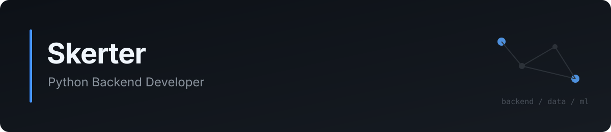

  

### Backend

`Python` `FastAPI` `Django` `Flask` `asyncio` `SQLAlchemy` `REST API`

### Databases

`PostgreSQL` `MySQL` `SQLite` `MongoDB` `ClickHouse` `Redis`

### Infrastructure

`Docker` `Kubernetes` `Helm` `Linux` `Nginx` `Caddy` `Traefik` `GitHub Actions`

### Testing

`pytest` `pytest-asyncio` `Factory Boy` `Testcontainers` `Alembic`

### Machine Learning

`pandas` `Dask` `scikit-learn` `XGBoost` `PyTorch` `TensorFlow` `MLflow`
